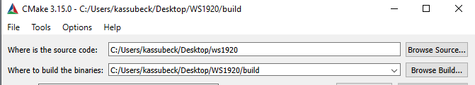
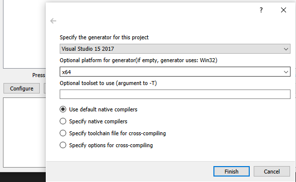
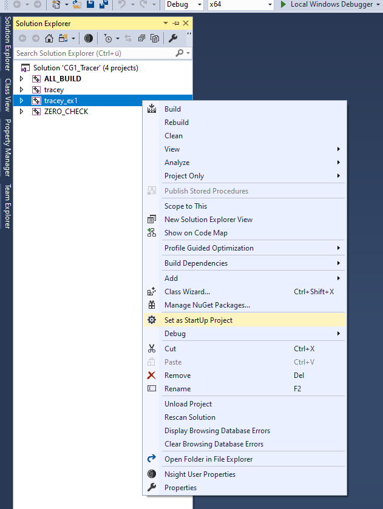

# Build-Anleitung Linux (und hoffentlich auch Mac):

## Sicherstellen, dass alle Abhängigkeiten installiert sind
Das Projekt davon ab, dass folgende Programme vorhanden und auffindbar sind:

```
cmake
make (ninja, ...)
g++ (clang, ...)
ImageMagick
```

## Repository auschecken (ab hier alles im Terminal):
`git clone gogs@FORK_OF_THIS_REPO`

oder 

`git -c http.sslVerify=false https://FORK_OF_THIS_REPO`

## Build Verzeichnis anlegen
`cd FOLDER`

`mkdir build`

`cd build`

## CMake und make ausführen
`cmake .. && make`

für schnelleres Bauen ist `make -j4` zu empfehlen

## Die gebaute Anwendung ausführen
`./tracey_ex1` oder `./tracey_exN`

# Build-Anleitung Windows

## Sicherstellen, dass alle Abhängigkeiten installiert sind
Das Projekt davon ab, dass folgende Programme vorhanden und auffindbar sind:

```
cmake
make (ninja, ...)
c++ Kompiler
ImageMagick
```

Der wahrscheinlich meistverbreitete C++ Kompiler für Windows ist der MSVC, der mit Visual Studio mitgeliefert wird. 
Studenten der TU können diesen kostenlos in Enterprise-Variante von https://doku.rz.tu-bs.de/doku.php?id=software:azure_dev_tools beziehen. 
Eine Community-Version ist auch verfügbar: https://visualstudio.microsoft.com/de/vs/

## Repository auschecken (im Terminal):
`git clone gogs@FORK_OF_THIS_REPO`

oder 

`git -c http.sslVerify=false https://FORK_OF_THIS_REPO`

## CMake-GUI ausführen


Auf _Configure_ klicken und sicherstellen, dass die entsprechende Version von Visual Studio verwendet wird:



Auf _Finish_ und auf _Generate_ (evtl. 2 mal) klicken.

Mit _Open Project_ sollte die entsprechende Solution in VS geöffnet werden (alternativ kann die _.sln_ aus dem Build-Ordner mit VS geöffnet werden).

## In Visual Studio bauen
Das _Startup Project_ auf die entsprechende Aufgabe setzen:



Mit _F5_ das Projekt bauen und gleichzeitig mit angehängtem Debugger starten. Nach erfolgreicher Beendigung sollte sich im `build`-Ordner die `result.png` befinden.